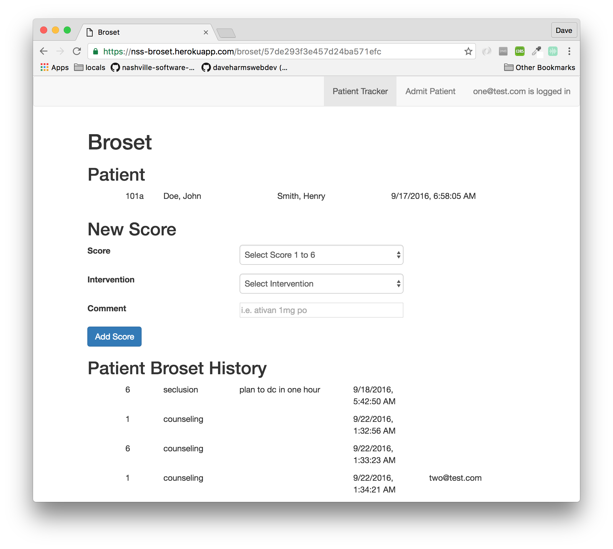

# Broset Violence Checklist
This is a static webserver/CRUD app. It demonstrates the use of Broset Violence Checklist.

## Broset Background
The [Broset](http://www.health.state.mn.us/patientsafety/preventionofviolence/brosettoolutilizationarticle.pdf) scale, which predicts violent behavior in psychiatric patients, was developed by Drs. Linaker and Busch-Iverson, while they were practicing at the Broset Secure Unit in Norway. It is a scale from 1-6 based on the behaviors of cofusion, irritablity, boisterousness, verbal threats, physical threats, and attacking objects.

## Functionality
A user can enter a patient (mock patients) into the app and then give the patient a broset score, as well the ability to add a comment.

## Technologies
Node/Express, Pug, MongoDB, Redis, Bcrypt, Passport, NPM, Bower and Bootstrap. This application demonstrates memory persistance, authentication and login sessioning.

## Hosting
The web server and session server are hosted on [Heroku](https://www.heroku.com/) at https://nss-broset.herokuapp.com/, and Mongo is hosted at [Mlab](https://mlab.com/).
